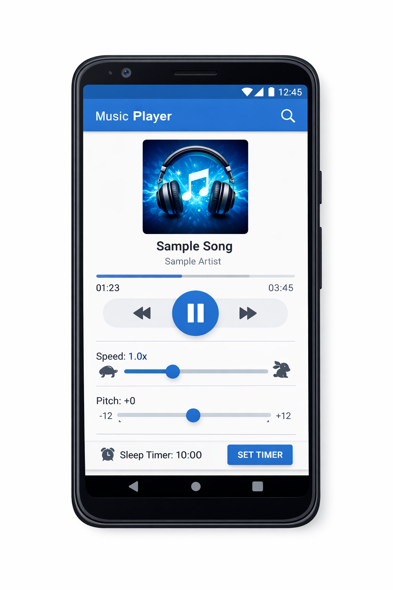

# Music-application
## アプリ画面
<p align="center">
  
</p>

## 目次
- [プロジェクト概要](#プロジェクト概要)
- [主な機能](#主な機能)
- [ディレクトリ構成](#ディレクトリ構成)
- [インストール方法](#インストール方法)
- [使い方](#使い方)
- [補足事項](#補足事項)

## プロジェクト概要

本リポジトリは、**Android 向けの音楽再生プレイヤーアプリ**のソースコードです。  
シンプルで直感的な UI を備え、複数の楽曲を再生しながら、再生時間の管理や再生速度・ピッチの調整を行うことができます。  
Android アプリ開発の学習および個人開発を目的として作成されています。

## 主な機能

- 複数の音楽ファイルの再生  
- **タイマー機能**による再生時間の制御  
- **再生速度・ピッチ変更機能**  
- シンプルで分かりやすい UI による操作  
- Android 標準 API を用いた音楽再生処理

## ディレクトリ構成

### プロジェクト全体
```
.
├── app/                       # Android アプリ本体
├── gradle/                    # Gradle ラッパー関連
├── gradlew                    # Gradle 実行スクリプト
├── gradlew.bat                # Windows 用 Gradle スクリプト
├── settings.gradle            # Gradle 設定
├── build.gradle               # プロジェクト全体のビルド設定
├── gradle.properties          # Gradle プロパティ
├── .gitignore
└── README.md                  # 本ファイル
```

### app/src/main 配下
```
app/src/main/
├── java/
│   └── com/example/musicapplication/
│       ├── MainActivity.java        # メイン画面・UI 制御
│       ├── PlayerManager.java       # 音楽再生処理の管理
│       └── TimerController.java     # タイマー機能の制御
│
├── res/
│   ├── layout/
│   │   ├── activity_main.xml        # メイン画面レイアウト
│   │   └── dialog_timer.xml         # タイマー設定ダイアログ
│   │
│   ├── drawable/                    # 画像・アイコンリソース
│   ├── values/
│   │   ├── colors.xml               # 色定義
│   │   ├── strings.xml              # 文字列リソース
│   │   └── styles.xml               # スタイル定義
│   │
│   └── mipmap/                      # アプリアイコン
│
└── AndroidManifest.xml              # アプリ設定・権限定義
```

※ クラス名や構成は実装内容に応じて調整してください。

本アプリでは、**UI（Activity）・音楽再生ロジック・タイマー制御を分離**することで、機能追加や保守がしやすい構成を採用しています。

## インストール方法

Android Studio を使用してビルドおよび実行します。

### 1. リポジトリのクローン
```bash
git clone https://github.com/otake-code/Music-application.git
cd Music-application
```

### 2. Android Studio でプロジェクトを開く

1. Android Studio を起動
2. "Open an Existing Project" を選択
3. クローンしたディレクトリを指定

### 3. ビルドと実行

1. エミュレーターまたは実機を接続
2. "Run" ボタンでアプリを実行

**動作環境:**
- Android Studio Arctic Fox 以上
- Android 11（API レベル 30）以上
- Gradle 7.0 以上

## 使い方

### 基本操作

1. アプリを起動します
2. 再生したい音楽を選択します
3. 再生／一時停止ボタンで音楽を操作します

### タイマー機能

1. タイマーアイコンをタップ
2. 再生時間を設定
3. 指定時間後に自動的に再生が停止します

### 再生速度・ピッチ調整

1. スライダーを操作して再生速度を調整
2. ピッチスライダーで音程を変更
3. リアルタイムで反映されます

## アーキテクチャ

本アプリは以下の3つの主要コンポーネントで構成されています：

- **MainActivity.java**: UI 制御とユーザー操作の処理
- **PlayerManager.java**: MediaPlayer を使った音楽再生の管理
- **TimerController.java**: タイマー機能の実装と制御

この設計により、各機能が独立しており、テストや拡張が容易になっています。

## 補足事項

- 対応する音楽ファイル形式や挙動は Android のメディア API に依存します
- Android 11（API レベル 30）以上での動作を想定しています
- 本アプリは学習および個人開発目的のプロジェクトです
- 音楽ファイルへのアクセスには適切な権限設定が必要です

## ライセンス

本プロジェクトのライセンスについては、`LICENSE` ファイルを参照してください。

## コントリビューション

Issues や Pull Requests を歓迎します。バグ報告や機能追加の提案がある場合は、お気軽にお知らせください。

## 連絡先

質問や提案がある場合は、Issue を作成するか、以下の連絡先までお問い合わせください：

- GitHub: [@otake-code](https://github.com/otake-code)
